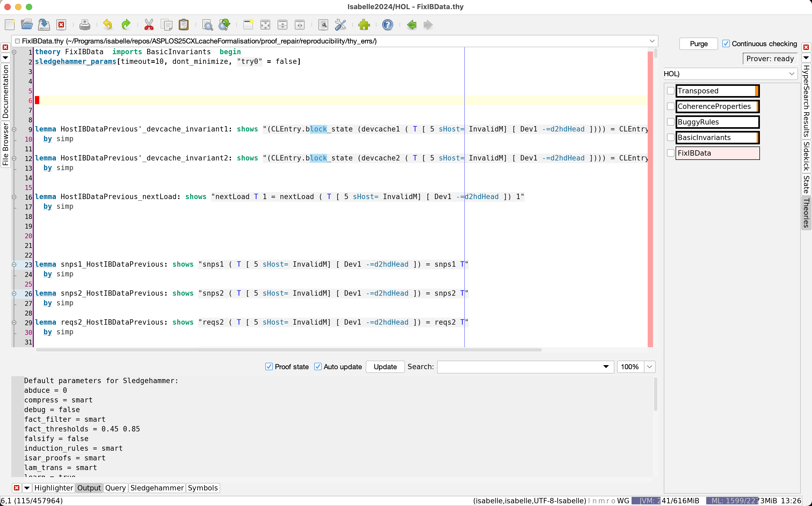
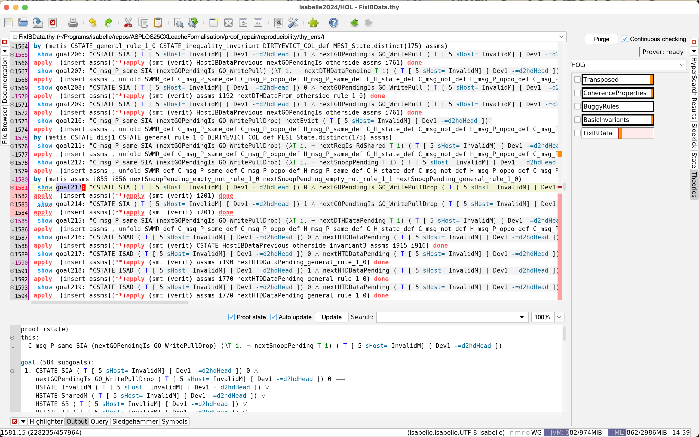
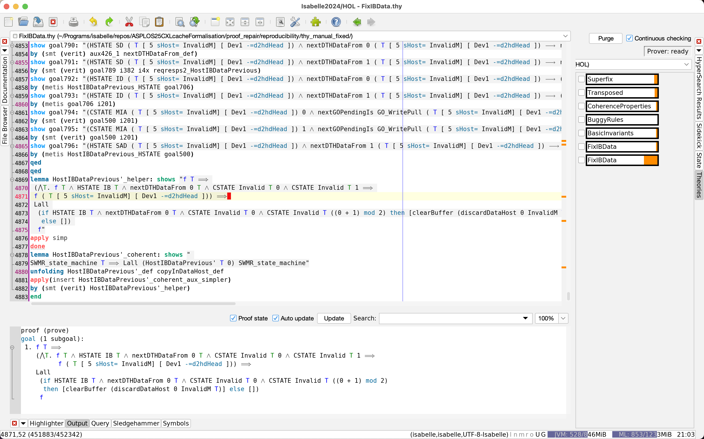

# The `super_sketch` and `super_fix` tools manual

This is the development repository for the `super_sketch` and `super_fix` tools presented in 
[*FormaliSE 2025*](https://conf.researchr.org/home/Formalise-2025#event-overview) for the 
[Isabelle](https://isabelle.in.tum.de/) proof assistant. 

The `super_sketch` tool automatically generates proofs for lemmas that may be split into 
multiple subgoals. It is based and inspire by Isabelle's *Sledgehammer* tool and Florian Haftman's 
[`Sketch_and_Explore`](https://isabelle.in.tum.de/dist/library/HOL/HOL-ex/Sketch_and_Explore.html)
library.

The `super_fix` tool was designed to automate the process of fixing an almost-correct theory file 
in the same way a human user would. The *almost-correct* usage refers to states where definitions, 
functions, and datatypes are assumed to be valid, but there are some proofs about them that are
not accepted, often due to an upstream modification of a definition.

Together with some Python scripting, these tools have helped in a large invariant verification 
project with 800 conjuncts and almost 54000 proof obligations. See below for usage examples.

## Requirements
  * The `supper_sketch` tool currently supports both Isabelle2023 and Isabelle2024.
    - To make it work for Isabelle2023, copy the files `Super2023.thy` and `SC2023.ML` into your working folder and import the theory as `Super2023`.
  * The `supper_fix` tool has been tested using Isabelle2024 in Unix systems.

## Getting started

### Isabelle

You can launch Isabelle2024 with the tools preloaded either via:

```bash
$ export PATH=$PATH:/full/path/to/your/Isabelle2024/bin
$ cd /full/path/to/this/project/repo/super_sketch_and_super_fix
$ isabelle jedit -d ./Super_Sketch
```

or 

```bash
$ export PATH=$PATH:/full/path/to/your/Isabelle2024/bin
$ cd /full/path/to/this/project/repo/super_sketch_and_super_fix
$ isabelle jedit -d ./Super_Fix
```

Alternatively, you could add them to your trusted Isabelle sessions (i.e. ROOTS) in `~/.isabelle/ROOTS` or `~/.isabelle/Isabelle2024/ROOTS` writing there the path to this project's `ROOTS` file.

### Super sketch

Invoke the utility by the command `super_sketch(...)`, where you fill in the `...` with some methods like `intro conjI`,`induct $VAR`, `cases $VAR` (where $VAR is a variable appearing in your theorem/lemma) and etc.

### Super fix

There are three steps to work with `super_fix`:
  - Locate a `.thy` file with errors.
  - Create a fixer `.thy` file and run it with Isabelle2024.
  - Locate the fixed file in the specified output directory.

Below we provide a more detailed example of these steps on a `.thy` file with errors provided by us.

1. Open this repo's `/Super_Fix/Examples/thys_with_errors/FixIBData.thy`. After waiting for it to load you
should be able to see something similar to the snapshot below (notice that `FixIBData.thy` is still in red):



2. If you scroll down to the middle of the file to `goal213`, you can see that the file contains an error
(indicated by the red color and the last part of the message in the Output panel).

**WARNING**: If you scroll further down, your Isabelle might loop in a downstream step (due to the missing 
proof of `goal213`). If you wish to avoid this, do NOT scroll further down.



3. Let's automatically fix this file (`/Super_Fix/Examples/thys_with_errors/FixIBData.thy`) with `super_fix`. 
You can use the same method later for any of the other `Fix*.thy` files in the directory 
`/Super_Fix/Examples/thys_with_errors/` (or any other almost-correct file). To start, 
create a new `FixIBData.thy` file in this repository's `/Super_Fix/Examples/thy_manual_fixers/` directory 
(already provided) and copy the following code-snippet to it:

**WARNING 1**: Before copy-pasting the code below, be sure to correct the paths and names for the `Fix*.thy` 
that you are using in the variables `read_thy_path` and `write_dir`.

**WARNING 2**: It is important to preserve the structure of the `.thy` file that is being fixed. 
Otherwise, the tool will fail. The places where one has to pay attention are 
(1) the name of the file itself, 
(2) after the command `theory` (below),
(3) in the declaration of the variables `read_thy_path` and `write_thy_name` below,
(4) the original file imports

```SML
theory FixIBData  
  imports 
    Super_Fix.Super_Fix
    "../examples_deps/BasicInvariants" 
begin

ML ‹
val read_thy_path = "/full/path/to/this/artefact/thy_errs/FixIBData.thy";
val write_thy_name = "FixIBData.thy";
val write_dir = "/full/path/to/this/artefact/thy_manual_fixed/";
Fixer.fix_end_to_end \<^theory> read_thy_path write_thy_name write_dir
›

end
```

4. You will see Isabelle turn your code snippet into dark purple (see image below), which means that Isabelle is processing the file `FixIBData.thy` in `thys_with_errors`, and writing another file with the same name in the directory `/Super_Fix/Examples/thy_manual_fixed`. After 2 minutes (in a 16GB RAM computer with Apple sillicon M2Pro), the purple shading will disappear. Moreover, you will see in the `Output` panel that `goal213` is fixed (shown in yellow in the snapshot below).


5. Once the purple color disappears, you can check the fixed file in 
`/Super_Fix/Examples/thy_manual_fixed/FixIBData.thy`. 
This time, you can confidently scroll to the bottom of the file. 
There will be no errors shown anywhere (red color on the scroll bar).



Congratulations! You have fixed a `.thy` file with `super_fix`. 

**WARNING** Remember that `super_fix` does not necessarily fix all errors:
  * In particular, `super_fix` ignores errors in proofs ending with `by` because Isabelle itself marks the `by` keyword as completing the proof (even if it is a failed conclusion). Thus, change all `by` statements
with `apply...done`. 
  * If `super_fix` detects a goal it could not solve, it writes a `sorry`. Search for `sorry`s with Isabelle's search function. Places where `sorry`s are introduced require a proof-expert to look at the result, but you can try your luck calling `super_sketch`.